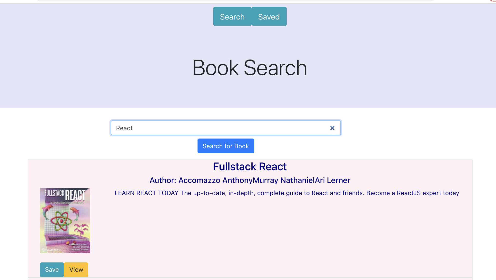
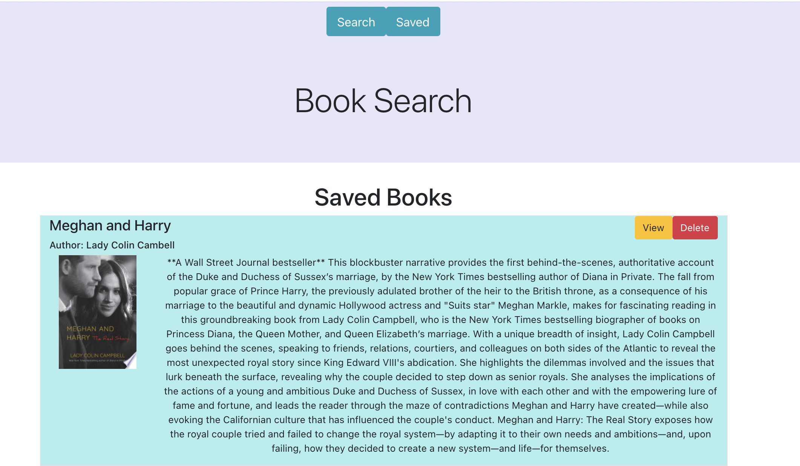

# Book-Search

## Description
This application uses react and Google API to search for book. Users can save books to their list come back to view and delete. 

## Table of Contents

- [Deployment](#deployment)
- [Contributing](#contributing)
- [Questions](#questions)
- [Resources](#resources)
- [License](#license)

## Deployment

## Contributing

If you would like to make this application better then please fork this repo. Create your branch. Push your changes. Lastly, open a pull request on GitHub for me to approve.

## Questions

If you have any questions or would like to contribute you can view my GitHub account:
(https://github.com/erumd)
or email me erumdhukka531@gmail.com.

## Resources

https://www.youtube.com/watch?v=kL3H-wTWPSQ&t=1211s&ab_channel=Congar-Programming

https://www.youtube.com/watch?v=6sBqMyUOcl8&ab_channel=JasonRivera

## License

MIT License

    Copyright (c) [2021] [erumd]

    Permission is hereby granted, free of charge, to any person obtaining a copy
    of this software and associated documentation files (the "Software"), to deal
    in the Software without restriction, including without limitation the rights
    to use, copy, modify, merge, publish, distribute, sublicense, and/or sell
    copies of the Software, and to permit persons to whom the Software is
    furnished to do so, subject to the following conditions:

    The above copyright notice and this permission notice shall be included in all
    copies or substantial portions of the Software.

    THE SOFTWARE IS PROVIDED "AS IS", WITHOUT WARRANTY OF ANY KIND, EXPRESS OR
    IMPLIED, INCLUDING BUT NOT LIMITED TO THE WARRANTIES OF MERCHANTABILITY,
    FITNESS FOR A PARTICULAR PURPOSE AND NONINFRINGEMENT. IN NO EVENT SHALL THE
    AUTHORS OR COPYRIGHT HOLDERS BE LIABLE FOR ANY CLAIM, DAMAGES OR OTHER
    LIABILITY, WHETHER IN AN ACTION OF CONTRACT, TORT OR OTHERWISE, ARISING FROM,
    OUT OF OR IN CONNECTION WITH THE SOFTWARE OR THE USE OR OTHER DEALINGS IN THE
    SOFTWARE.
